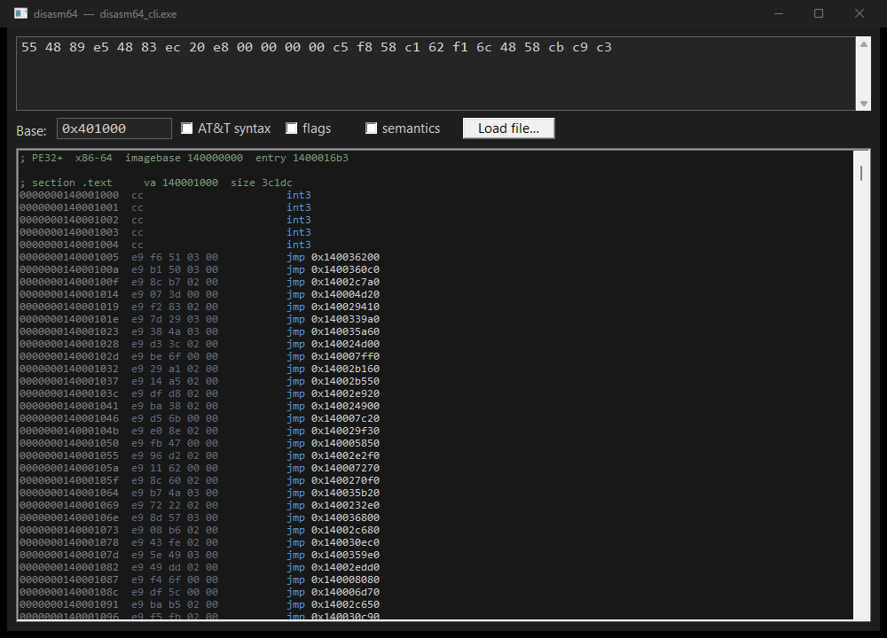

# disasm64

[](https://github.com/goldzik1/disasm64/actions/workflows/ci.yml)
[](https://github.com/goldzik1/disasm64/releases/latest)


A from-scratch x86-64 instruction decoder in C++17. No Capstone, no Zydis, no
dependencies — drop the headers and `src/` into a project and you have a disassembler.
It decodes a byte stream into a structured instruction (mnemonic, typed operands with
sizes, prefixes, length), resolves RIP-relative addressing, and prints Intel or AT&T syntax.

But decoding is table stakes. What this does that a plain disassembler doesn't:

- **flags obfuscation** — redundant prefixes, over-long encodings, and other
  non-canonical forms that are the fingerprints of packers, watermarking, and
  hand-crafted code;
- **catches anti-disassembly** — branches that jump into the middle of another
  instruction (hidden / overlapping code), the classic linear-sweep trap;
- **relocates instructions** — moves an instruction to a new address with RIP-relative
  and rel32 fixed up, which is exactly the primitive a trampoline hook needs, so it also
  **plans hooks** (how many bytes to steal, relocated and ready to place).

```
$ disasm64 --base 0x401000 66 66 90 48 8b 80 05 00 00 00 eb 01 48 90
0000000000401000  66 66 90                 nop
                    ! duplicate prefix
0000000000401003  48 8b 80 05 00 00 00     mov rax, qword ptr [rax+0x5]
                    ! over-long disp32 (fits in disp8)
000000000040100a  eb 01                    jmp 0x40100d
000000000040100c  48 90                    nop
000000000040100a  !! branch target inside another instruction (anti-disassembly)
```

## Desktop GUI

A small native front-end (`gui/`, Win32, dark theme, no dependencies) disassembles as you
type, with syntax colouring and the same quirk / anti-disassembly annotations. Grab the
prebuilt `disasm64_gui.exe` from the [latest release](https://github.com/goldzik1/disasm64/releases/latest)
and just run it, or build it with `cmake --build build --target disasm64_gui`.



## Coverage

The general-purpose integer ISA — the legacy one/two-byte maps and REX: the arithmetic
group, mov/lea/push/pop, the shift and group encodings, test, imul, movzx/movsx/movsxd,
jcc/setcc/cmovcc, call/jmp/ret, string ops, bit ops, bswap/xadd/cmpxchg, bsf/bsr,
popcnt/lzcnt/tzcnt, crc32, the fences, movbe, endbr64 — with full ModRM / SIB /
displacement / RIP-relative addressing, byte-exact length.

The vector ISA — **SSE through SSE4.2 and AVX/AVX2**: moves, logic, arithmetic,
min/max, compares, conversions, the packed-integer set (padd/psub/pmul/pcmp/pack/punpck/
pavg/psad/pmin/pmax and the shift families), shuffles, blends, `ptest`, `pmovzx/sx`,
`palignr`, `roundps`, `dpps`, `pclmulqdq`, the `pcmp*str*` string ops — across the one-,
two-, and three-byte (`0F38`/`0F3A`) maps. Every one of these has its **AVX (VEX)** form
too: three-operand `vaddss xmm0, xmm1, xmm2`, `vpshufb ymm0, ymm0, ymm1`, ymm operands,
2- and 3-byte VEX.

And the **AVX-512 core over EVEX** (the `62h` prefix): the AVX-512F/BW/DQ arithmetic,
logic, move, compare and convert families on `zmm`/`ymm`/`xmm`, with the full 32-register
file, a writemask and zeroing (`vaddps zmm1{k1}{z}, zmm2, zmm3`), broadcast (`{1to16}`),
and `disp8*N` compressed displacement decoded to the right byte-exact length.

The **x87 FPU** — the full `D8`–`DF` map, both the memory forms (`fld`/`fst`/`fadd`/
`fild`/`fbld` sized down to `tbyte ptr`) and the `mod == 3` register forms: the `st(i)`
arithmetic, `fcmov*`, `fucomi`/`fcomi`, the load-constant and transcendental group
(`fld1`/`fldpi`/`fsin`/`fpatan`/`f2xm1`…), `fnstsw ax`, and the `fsub`/`fsubr` reg-form
swap handled per the SDM.

The **system and privileged** layer that RE and hypervisor work actually hits: `mov` to/
from `cr`/`dr`, the group-6/7 descriptor-table ops (`sgdt`/`lgdt`/`sidt`/`lidt`/`sldt`/
`lldt`/`str`/`ltr`/`smsw`/`lmsw`/`invlpg`), `swapgs`, `rdtscp`, `wrmsr`/`rdmsr`/`rdpmc`,
`sysenter`/`sysexit`/`sysret`, `vmread`/`vmwrite` and the `0F 01` VMX/SGX leaves
(`vmcall`/`monitor`/`xgetbv`/`clac`…), `rdfsbase`/`wrgsbase`, `clts`, `invd`/`wbinvd`,
`lar`/`lsl`, `lss`/`lfs`/`lgs`, `fxsave`/`xsave`/`clflushopt`. Plus the rest of the GP
tail — `in`/`out`, string I/O, `loop`/`jrcxz`, `enter`/`leave`, far `call`/`jmp`,
`shld`/`shrd`, `movnti`, `lahf`/`sahf` — and **SHA-NI**, `movq`, `haddpd`/`addsubps`,
`rsqrtps`/`rcpps`, `cvtpd2dq`, `maskmovdqu`.

The decoder rejects what the hardware rejects, too: `LOCK` only on a lockable op with a
memory destination, `VEX.vvvv` required `1111` where there's no third operand, REX and
`66`/`F2`/`F3` before `VEX` as `#UD`, `mov` to `CS`.

**Validated two ways.** Fuzzed to never crash, hang, or return a nonsense length on
arbitrary input — millions of random decodes, zero anomalies. And **differentially
checked against [iced-x86](https://github.com/icedland/iced)** (`tools/diff_iced.py`):
random + structured byte streams are decoded by both and compared — instruction **length
matches on every valid instruction**, with validity agreement across millions of samples.

## The RE layer

```cpp
#include "disasm64/analysis.h"

// what a trampoline hook needs: steal >= 5 bytes of whole instructions, relocated
disasm64::HookPlan hp = disasm64::planHook(code, n, addr, trampolineAddr, 5);
// hp.stolenBytes, hp.relocatable, hp.relocated  (valid at trampolineAddr)

// obfuscation / hand-crafted-code signals for one instruction
for (const char* issue : disasm64::analyzeEncoding(code, n, addr)) puts(issue);

// hidden / overlapping code across a range
for (auto& f : disasm64::antiDisasmScan(code, n, base)) /* f.address, f.what */;
```

`relocate` underpins the hook planner and is exposed on its own — position-independent
instructions come back byte-for-byte, RIP-relative and rel32 displacements are fixed up
so the effective target is preserved.

## Encoder — the decode is reversible

```cpp
#include "disasm64/encode.h"

disasm64::DecodeResult d = disasm64::decode(bytes, n, addr);
uint8_t out[16];
disasm64::EncodeResult e = disasm64::encode(d.insn, out, sizeof out);   // e.length bytes
```

`encode` re-emits an `Instruction` to machine code, so the pipeline is
decode → **mutate the structured instruction** → encode: rewrite operands, promote a
short branch to `rel32`, drop a prefix, build a patch. It covers the general-purpose
integer core (SIMD/x87 report `Unsupported`) and picks a canonical encoding — the REX,
ModRM/SIB, displacement and immediate widths, the `moffs` form for a 64-bit absolute, the
`mov cr/dr` and segment forms. It's held to a **round-trip invariant checked over millions
of samples**: for every instruction the encoder accepts, `decode(encode(i))` reproduces
`i`.

## Building

Drop `include/` and `src/` into your project, or take the **single header** — one file,
STB-style:

```cpp
#define DISASM64_IMPLEMENTATION   // in exactly one translation unit
#include "disasm64.h"             // from single_include/
```

Or build the tests, examples, and CLI with CMake:

```
cmake -S . -B build
cmake --build build
ctest --test-dir build
```

C++17, no dependencies, builds with MSVC or gcc/clang. Regenerate the single header with
`tools/amalgamate.sh` after editing the split sources. The optional differential test needs
only `pip install iced-x86`, then `python tools/diff_iced.py --tool build/difftool`.

## The model

`decode(bytes, n, address)` returns a `DecodeResult` with a status and an
`Instruction`: mnemonic, up to four typed `Operand`s (register / memory / immediate /
relative, each with a size), the prefixes, the length, and a `positionDependent` flag.
The **Intel and AT&T** formatters are thin layers over that model — the structured decode
is the point, so the same output feeds an analyzer or a lifter, not just a printer.
Per-instruction EFLAGS read/written are already on the model (`flagsRead`/`flagsWritten`),
and so is **semantic metadata**: each operand carries a read / write / read-write `access`,
and the instruction carries a `category` (gpr, branch, stack, string, sse, avx, avx512,
x87, system, …). So `add rax, rbx` reports `rax` read-write and `rbx` read — enough to
drive a dataflow pass without a second table. The CLI shows it with `--sem`, `--flags`
surfaces EFLAGS, and `--att` switches syntax.

## Bindings, playground & speed

A flat **C ABI** (`include/disasm64/c_api.h`, built as `disasm64_c`) exposes decode /
format / relocate for FFI. On top of it:

- **Python** — `bindings/python/disasm64.py`, ctypes, no build step beyond the shared lib:
  ```python
  from disasm64 import Disasm64
  d = Disasm64()
  d.format(bytes.fromhex("62f16c4858cb"))   # 'vaddps zmm1, zmm2, zmm3'
  ```
- **WebAssembly playground** — `wasm/`: `build.sh` (needs emsdk) compiles to wasm and
  `playground.html` disassembles pasted hex in the browser, quirk annotations and all.

`tools/bench` measures throughput. On one modern x86 core (Release), the linear decoder
runs at roughly **34 M instructions/s (~107 MB/s)**; decode + Intel formatting ~9 M/s;
decode + re-encode ~24 M/s.

## Roadmap

- Semantic metadata already carries per-operand access and category; the next step is
  **implicit operands** (the `rdx:rax` of `mul`, the `rsp` of `push`/`call`, the
  `rsi`/`rdi`/`rcx` of the string ops) as first-class reads/writes.
- Extend EVEX beyond the map-1 core: the `0F38`/`0F3A` AVX-512 maps, gather/scatter, the
  mask-register (`k`) instruction set, and embedded rounding `{er}`/`{sae}`.
- Fold the iced-x86 differential into CI and widen it to mnemonic/operand agreement, not
  just length and validity.

## Scope

x86-64 long mode, Intel and AT&T syntax. AVX-512 covers the EVEX map-1 core; the `0F38`/
`0F3A` AVX-512 maps and gather/scatter are still on the roadmap.
